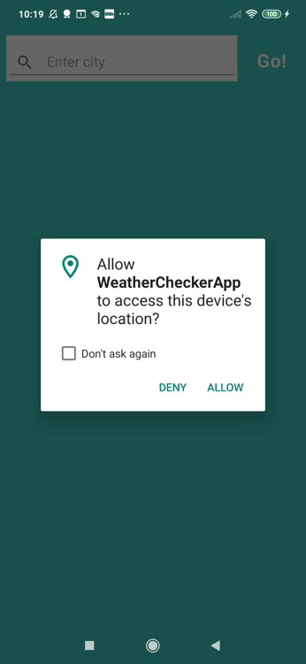

# WeatherApp

Android Weather app developed in Kotlin. The app is composed of a single screen and the app widget.

## WeatherFragment
Displays current weather conditions and a 14-day forecast for the device's location. It also allows to search the weather by a city name. 
The app integrates <b>coroutines with Retrofit</b> to fetch weather information and binds all UI components in the XML layout to data sources using a <b>DataBinding</b> rather than programmatically. The UI calls are done in <b>Binding Adapters</b> reducing boilerplate code in the fragment. All is done following <b>Model-View-ViewModel</b> (MVVM) architecture for the presentation layer. Using repository the web services is abstracted from the rest of the app. The weather is exposed from the view model via <b>LiveData</b> and bound to a views so they're refreshed automatically when condition changes. The button's onClick attribute and the TextWatcher attached to the EditText are bound to the view model via a <b>lambda expression.</b>  

## Widget
Displays up to date weather info for the current device's location. The widget is updated periodically with new data through a <b>WorkManager</b>. When the widget is added to the screen, the WorkManager schedules <b>repeated background work</b> to request location updates and fetch weather data from the API performing <b>suspending work</b>. When the widget is removed the background work is terminated.  In addition to the FINE location permission, the app has support for Android 10 and 11 by adding logic to access location in the background (android.permission.ACCESS_BACKGROUND_LOCATION). 

## Design
+ App offers a full <b>edge-to-edge</b> screen experience (draws behind the transparent navigation and status bars) and uses insets to move controls away from gesture area.
+ The app displays Snackbar explaining importance of the location permission with an <b>action</b>, that allows the user to navigate to the settings.
+ Scrolling list of forecasts is displayed in the RecyclerView widget.
+ Styled button behaves intuitively changing their appearance when they are pressed.
+ Spinner is displayed when the data is loaded.

## Libraries and tools used:
+ Retrofit to make REST requests to the web service integrated with Coroutine to run operations in the background without creating multiple callbacks. <br/>
+ Moshi to handle the deserialization of the returned JSON to Kotlin data objects.<br/>
+ Android Architecture Components (ViewModel, LiveData, Data Binding, WorkManager).<br/>
+ The app accesses the set of supported location services through classes in the com.google.android.gms.location package.

## Preview

 
<br> 
  


## Resources
+ Icons from Flaticon.com (byFreepik, Swifticons, Good Ware, Vitaliy Gorbachev, Those Icon, Hirschwolf Lineal, Iconixar, Eucalyp, Pixel Perfect).

## OpenApi
+ using the OpenWeatherMapAPI for constructing RESTful.<br/>

## License

[](https://www.apache.org/licenses/LICENSE-2.0.html)

```
Copyright 2020 Ersiver

Licensed under the Apache License, Version 2.0 (the "License");
you may not use this file except in compliance with the License.
You may obtain a copy of the License at

   http://www.apache.org/licenses/LICENSE-2.0

Unless required by applicable law or agreed to in writing, software
distributed under the License is distributed on an "AS IS" BASIS,
WITHOUT WARRANTIES OR CONDITIONS OF ANY KIND, either express or implied.
See the License for the specific language governing permissions and
limitations under the License.
